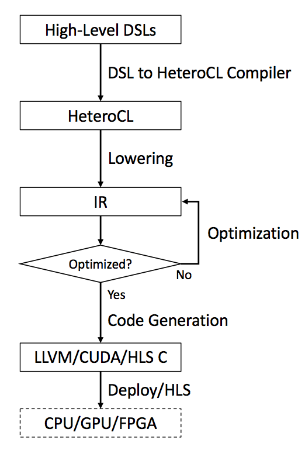

HeteroCL: Heterogenous Computing Language
=========================================

[Installation](docs#installation-guide) | [Tutorials](http://people.ece.cornell.edu/yl2666/heterocl/docs/build/html/tutorials/index.html) | [Documentation](http://people.ece.cornell.edu/yl2666/heterocl/docs/build/html/)

## Introduction

With the pursuit of improving compute performance under strict power constraints, there is an increasing need for deploying applications to heterogeneous hardware architectures with accelerators, such as GPUs and FPGAs. However, although these heterogeneous computing platforms are becoming widely available, they are very difficult to program especially with FPGAs. As a result, the use of such platforms has been limited to a small subset of programmers with specialized hardware knowledge.

To tackle this challenge, we introduce HeteroCL, a programming infrastructure comprised of a Python-based domain-specific language (DSL) and an FPGA-targeted compilation flow. The HeteroCL DSL provides a clean programming abstraction that decouples algorithm specification from three important types of hardware customization in compute, data types, and memory architectures. HeteroCL can further capture the interdependence among these different customization techniques, allowing programmers to explore various performance/area/accuracy trade-offs in a systematic and productive manner. In addition, our framework currently provides two advanced domain-specific optimizations with stencil analysis and systolic array generation, which produce highly efficient microarchitectures for accelerating popular workloads from image processing and deep learning domains.

## Comparison with TVM
