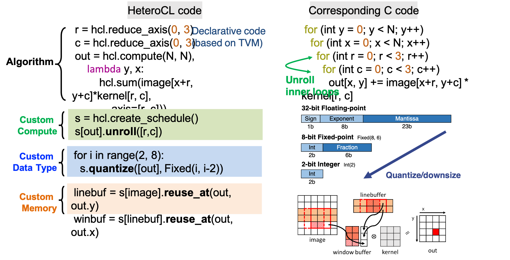
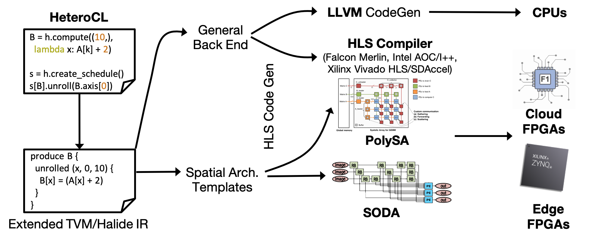

HeteroCL: A Multi-Paradigm Programming Infrastructure for Software-Defined Reconfigurable Computing
===================================================================================================

[Website](http://heterocl.csl.cornell.edu/web/index.html) | [Installation](http://heterocl.csl.cornell.edu/doc/installation.html) | [Tutorials](http://heterocl.csl.cornell.edu/doc/tutorials/index.html) | [Samples](http://heterocl.csl.cornell.edu/doc/samples/index.html) | [Documentation](http://heterocl.csl.cornell.edu/doc/index.html)

## Introduction

With the pursuit of improving compute performance under strict power constraints, there is an increasing need for deploying applications to heterogeneous hardware architectures with accelerators, such as GPUs and FPGAs. However, although these heterogeneous computing platforms are becoming widely available, they are very difficult to program especially with FPGAs. As a result, the use of such platforms has been limited to a small subset of programmers with specialized hardware knowledge.

To tackle this challenge, we introduce HeteroCL, a programming infrastructure comprised of a Python-based domain-specific language (DSL) and a compilation flow. The HeteroCL DSL provides a clean programming abstraction that decouples algorithm specification from three important types of hardware customization in compute, data types, and memory architectures. HeteroCL can further capture the interdependence among these different customization techniques, allowing programmers to explore various performance/area/accuracy trade-offs in a systematic and productive manner. In addition, our framework currently provides two advanced domain-specific optimizations with stencil analysis and systolic array generation, which produce highly efficient microarchitectures for accelerating popular workloads from image processing and deep learning domains.

## Language Overview

## Current Compilation Flow

## Evaluation on AWS F1 (Xilinx Virtex UltraScale+TM VU9P FPGA)
The speedup is over a single-core single-thread CPU execution on AWS F1.

| Benchmark & Data Sizes & Data Type | #LUTs | #FFs | #BRAMs | #DSPs | Freq. (MHz) | CPU Runtime (ms) | FPGA Runtime (ms) | Speedup |
| :-------- | :----------------: | :----: | :----:| :-----: | :----: | :------------: | :------:| :------: |
| **[KNN Digit Recognition](samples/digitrec/)** K=3 #images=1800 `uint49` | 4.1k (0.42%) | 5.5k (0.26%) | 38 (2.0%) | 0 (0.0%) | 250 | 0.73 | 0.07 | 10.4 |
| **[K-Means](samples/kmeans)** K=16 #elem=320 x 32 `int32` | 168.2k (16.6%) | 212.1k (10.0%) | 54 (2.8%) | 1.5k (22.5%) | 187 | 65.6 | 0.79 | 83.0 | 
| **[Jacobi(Stencil)](samples/jacobi)** 480x640 `fp32` | 15.2k (1.5%) | 26.5k (1.24%) | 30 (1.54%) | 99 (1.29%) | 250 | 16.27 | 2.21 | 7.36 | 
| **[Gaussian(Stencil)](samples/gaussian)** 480x640 `fp32` | 28.9k (2.8%) | 49.9k (2.4%) | 30 (1.54%) | 344 (5.1%) | 250 | 20.31 | 1.6 | 13.2 | 
| **[Siedel(Stencil)](samples/seidel)** 480x640 `fp32` | 10.2k (0.99%) | 19.1k (0.89%) | 23 (1.18%) | 56 (0.82%) | 250 | 23.86 | 1.42 | 16.8 | 

## Related Publications

+ Shaojie Xiang, Yi-Hsiang Lai, Yuan Zhou, Hongzheng Chen, Niansong Zhang, Debjit Pal, Zhiru Zhang.
  [HeteroFlow: An Accelerator Programming Model with Decoupled Data Placement for Software-Defined FPGAs](https://www.csl.cornell.edu/~zhiruz/pdfs/heteroflow-fpga2022.pdf).
  In FPGA, 2022.
+ Yi-Hsiang Lai1, Yuze Chi, Yuwei Hu, Jie Wang, Cody Hao Yu, Yuan Zhou, Jason Cong, Zhiru Zhang.
  [HeteroCL: A Multi-Paradigm Programming Infrastructure for Software-Defined Reconfigurable Computing](https://www.csl.cornell.edu/~zhiruz/pdfs/heterocl-fpga2019.pdf).
  In FPGA, 2019. (Best Paper Award)

## Related Work

HeteroCL is a Python-based DSL extended from TVM and it extends Halide IR for intermediate representation. HeterCL incoporates the SODA framework, PolySA framework, and Merlin Compiler for FPGA back-end generation.

* **[Stencil with Optimized Dataflow Architecture](https://vast.cs.ucla.edu/~chiyuze/pub/iccad18.pdf)** (SODA)
* **[Polyhedral-Based Systolic Array Auto-Compilation](http://cadlab.cs.ucla.edu/~jaywang/papers/iccad18-polysa.pdf)** (PolySA)
* **[Merlin Compiler](https://www.falconcomputing.com/merlin-fpga-compiler/)**
* **[Halide](https://halide-lang.org)**
* **[TVM](https://tvm.ai)**

## Contributing to HeteroCL

### Coding Style (Python)

We follow [official Python coding style](https://www.python.org/dev/peps/pep-0008/#descriptive-naming-styles) and use [NumPy docstring style](https://numpydoc.readthedocs.io/en/latest/format.html#other-points-to-keep-in-mind).

### Coding Style (C and C++)

We follow [Google coding style](https://google.github.io/styleguide/cppguide.htm).

### Steps

1. Use [clang-format](https://clang.llvm.org/docs/ClangFormat.html) to format your C-related files. The configuration file is in `docs/.clang-format`. Following is a sample command to format the file in place. Note that you need to put the configuration file at the same directory you execute the command.

   ``clang-format -i -style=file <cpp-file>``
2. Use [Pull Request](https://help.github.com/articles/about-pull-requests/). Remember to select the most suitable labels and put it in the title.
3. Make sure all the tests pass.
