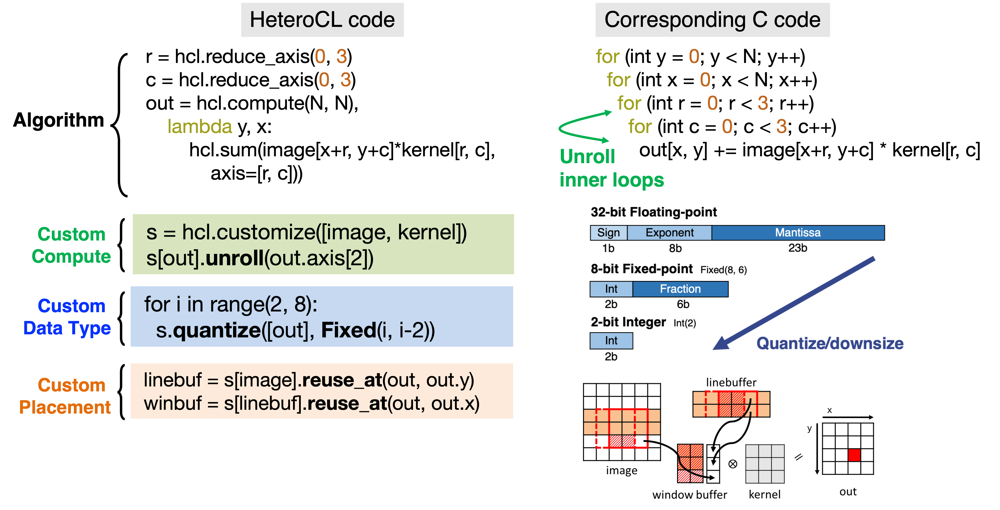
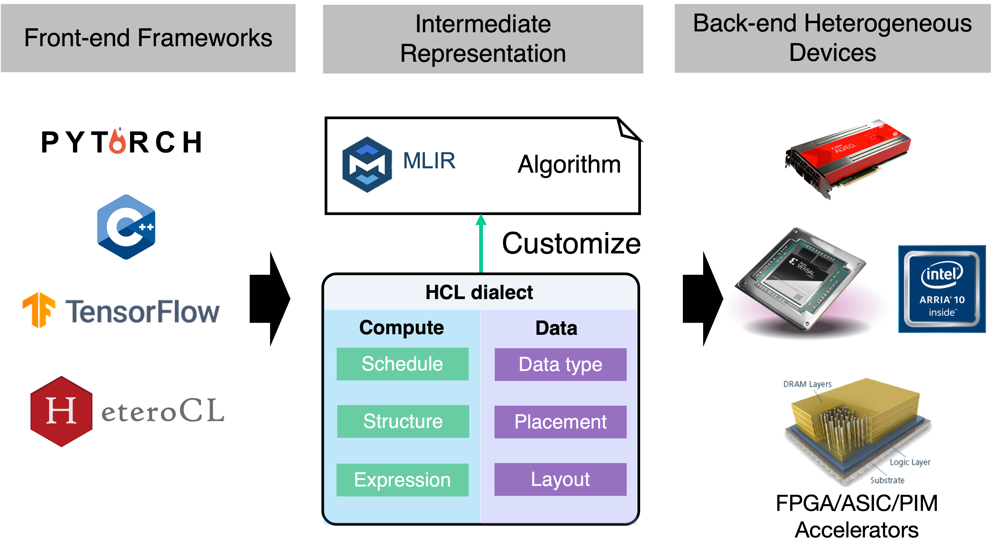

<!--- Copyright HeteroCL authors. All Rights Reserved. -->
<!--- SPDX-License-Identifier: Apache-2.0  -->

[](./LICENSE)
[](https://circleci.com/gh/cornell-zhang/heterocl/tree/main)

HeteroCL: A Multi-Paradigm Programming Infrastructure for Software-Defined Reconfigurable Computing
===================================================================================================

[Website](http://heterocl.csl.cornell.edu/web/index.html) | [Installation](https://cornell-zhang.github.io/heterocl/setup/index.html) | [Tutorials](https://cornell-zhang.github.io/heterocl/index.html) | [Documentation](https://cornell-zhang.github.io/heterocl/index.html)

## Introduction

With the pursuit of improving compute performance under strict power constraints, there is an increasing need for deploying applications to heterogeneous hardware architectures with accelerators, such as GPUs and FPGAs. However, although these heterogeneous computing platforms are becoming widely available, they are very difficult to program especially with FPGAs. As a result, the use of such platforms has been limited to a small subset of programmers with specialized hardware knowledge.

To tackle this challenge, we introduce HeteroCL, a programming infrastructure comprised of a Python-based domain-specific language (DSL) and a compilation flow. 
The HeteroCL DSL provides a clean programming abstraction that decouples algorithm specification from hardware customizations including compute and data customizations. HeteroCL can further capture the interdependence among these different customization techniques, allowing programmers to explore various performance/area/accuracy trade-offs in a systematic and productive manner. 
<!-- In addition, our framework currently provides two advanced domain-specific optimizations with stencil analysis and systolic array generation, which produce highly efficient microarchitectures for accelerating popular workloads from image processing and deep learning domains. -->

## Language Overview



## Current Compilation Flow



## Install MLIR-based HeteroCL
To install the HeteroCL-MLIR dialect, please make sure you have installed the tools below:

- gcc >= 5.4
- cmake >= 3.19
- python >= 3.7

The following script shows the complete process of building the HeteroCL-MLIR dialect and connecting it with the HeteroCL frontend. It may take about 10 minutes to install the LLVM package depending on the internet connection and the hardware resource of your machine. If you are a HeteroCL developer, please refer to the guide in the [HCL-MLIR](https://github.com/cornell-zhang/hcl-dialect) repository and build the dialect with the Python binding from source.

```bash
git clone https://github.com/cornell-zhang/heterocl.git heterocl-mlir
cd heterocl-mlir
git submodule update --init --recursive
pip install . -v
# export LLVM path
export LLVM_BUILD_DIR=$(pwd)/hcl-dialect/externals/llvm-project/build
export PATH=${LLVM_BUILD_DIR}/bin:${PATH}
```

To verify HeteroCL is installed correctly, you can run the following test.

```bash
python3 -m pytest test
```


## Related Publications

* Debjit Pal, Yi-Hsiang Lai, Shaojie Xiang, Niansong Zhang, Hongzheng Chen, Jeremy Casas, Pasquale Cocchini, Zhenkun Yang, Jin Yang, Louis-Noël Pouchet, Zhiru Zhang. [Accelerator Design with Decoupled Hardware Customizations: Benefits and Challenges](https://www.csl.cornell.edu/~zhiruz/pdfs/hcl-invited-dac2022.pdf). In DAC, 2022. (Invited Paper)
* Shaojie Xiang, Yi-Hsiang Lai, Yuan Zhou, Hongzheng Chen, Niansong Zhang, Debjit Pal, Zhiru Zhang. [HeteroFlow: An Accelerator Programming Model with Decoupled Data Placement for Software-Defined FPGAs](https://www.csl.cornell.edu/~zhiruz/pdfs/heteroflow-fpga2022.pdf). In FPGA, 2022.
* Yi-Hsiang Lai, Yuze Chi, Yuwei Hu, Jie Wang, Cody Hao Yu, Yuan Zhou, Jason Cong, Zhiru Zhang. [HeteroCL: A Multi-Paradigm Programming Infrastructure for Software-Defined Reconfigurable Computing](https://www.csl.cornell.edu/~zhiruz/pdfs/heterocl-fpga2019.pdf). In FPGA, 2019. (Best Paper Award)

## Related Work

* **[MLIR](https://arxiv.org/pdf/2002.11054.pdf)**
* **[TVM](https://tvm.ai)** / **[Halide](https://halide-lang.org)**
* **[Stencil with Optimized Dataflow Architecture](https://vast.cs.ucla.edu/~chiyuze/pub/iccad18.pdf)** (SODA)
* **[Polyhedral-Based Systolic Array Auto-Compilation](http://cadlab.cs.ucla.edu/~jaywang/papers/iccad18-polysa.pdf)** (PolySA)
* **[Merlin Compiler](https://www.falconcomputing.com/merlin-fpga-compiler/)**


## Contributing to HeteroCL

### Coding Style (Python)

We follow [official Python coding style](https://www.python.org/dev/peps/pep-0008/#descriptive-naming-styles) and use [NumPy docstring style](https://numpydoc.readthedocs.io/en/latest/format.html#other-points-to-keep-in-mind). We use [Black](https://pypi.org/project/black/) and [PyLint](https://pylint.readthedocs.io/) to format Python code.

### Coding Style (C and C++)

We follow [Google coding style](https://google.github.io/styleguide/cppguide.htm). Please refer to the [hcl-dialect](https://github.com/cornell-zhang/hcl-dialect) repository for more details.
